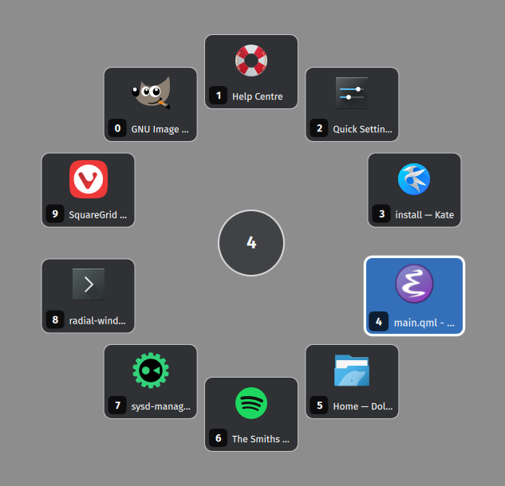

# Radial Window Switcher for KDE Plasma

A deliberately small Plasma 6 / KWin prototype.



## Behaviour

- Invoke with **Meta+Alt+W** (changeable through KDE's shortcut settings).
- The switcher appears around the current mouse position.
- Up to 10 windows are shown in **most-recently-used (MRU)** order.
- The effect tracks `Workspace.windowActivated` events continuously while loaded to maintain the list of windows in the same order as `Alt-Tab`.
- The currently active window is omitted, so item **1** is normally the previously active window.
- Move outside the centre dead zone toward a window to highlight its sector.
- Near an output edge, the circle automatically becomes an inward-facing fan; near corners the fan narrows further.
- **Left click** or **Enter** activates the highlighted window.
- **Right click** or **Escape** cancels.
- **Arrow keys** cycle through the entries.
- **1 ... 9, 0** directly activate entries 1 ... 10. **Ctrl+number** is accepted too.

## Install

```sh
git clone https://github.com/SpinningVinyl/kde-radial-window-switcher.git
kpackagetool6 --type KWin/Effect --install radial-window-switcher/
```

Then open **System Settings → Window Management → Desktop Effects**, find
**Radial Window Switcher**, and enable it.

If you edit the installed package and want to reinstall it:

```sh
kpackagetool6 --type KWin/Effect --upgrade radial-window-switcher/
```

You may need to toggle the effect off/on or log out of your user session and log back in after upgrading the package.

## Uninstall

```sh
kpackagetool6 --type KWin/Effect --remove radial-window-switcher
```

## Notes / prototype limitations

1. This is aimed at Plasma 6 / KWin 6 and uses current declarative-effect APIs.
2. It intentionally limits the radial menu to ten windows.
3. When the cursor is too close to an edge of the screen or to a corner, the geometry can become a bit (or a lot) whacky.
4. The effect excludes `specialWindow`, `skipSwitcher`, unmanaged/deleted windows, the currently active window and windows that do not want input. Please see `contents/ui/main.qml` for details.

## License

This program is free software; you can redistribute it and/or modify it under the terms of the GNU General Public License as published by the Free Software Foundation; either version 2 of the License, or (at your option) any later version.

This program is distributed in the hope that it will be useful, but WITHOUT ANY WARRANTY; without even the implied warranty of MERCHANTABILITY or FITNESS FOR A PARTICULAR PURPOSE. See the GNU General Public License for more details.
